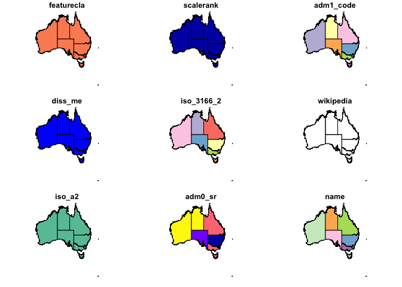
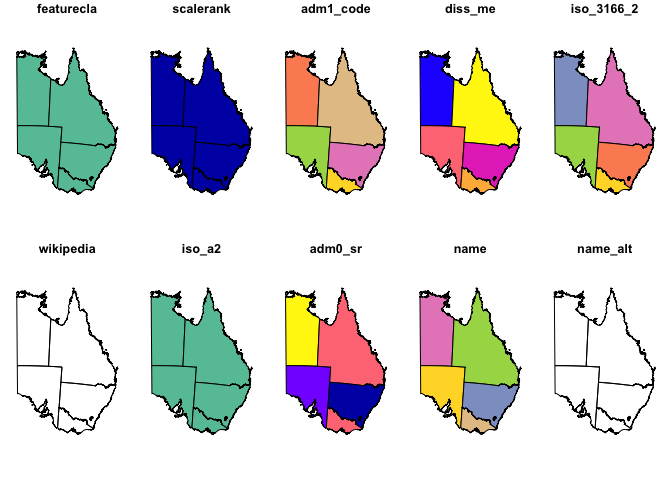
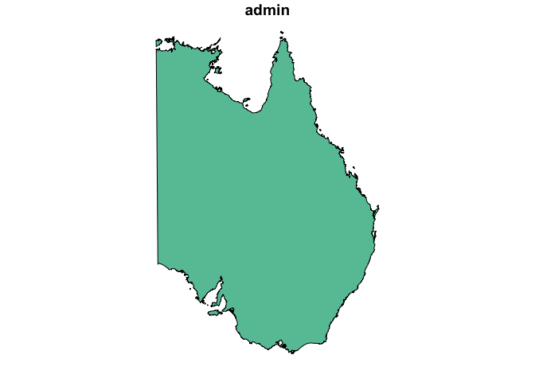

Create Qld and NSW State Map Base
================

## Load Libraries

``` r
library(rnaturalearth)
library(sf)
```

    ## Linking to GEOS 3.7.1, GDAL 2.3.2, PROJ 5.2.0

# Get the Data to Create Our Map

### Add a Shapefile of Australia

This is our base layer, Australia, of the map from
[Naturalearth.com](https://naturalearth.com/).

``` r
oz <- ne_states(geounit = "australia", returnclass = "sf")

plot(oz)
```

    ## Warning: plotting the first 9 out of 83 attributes; use max.plot = 83 to
    ## plot all

<!-- -->

## Crop and Reproject

However, for the data that this package is intended for use with, only
New South Wales and Queensland are necessary.

Also for cartography purposes, we will reproject the map to Australian
Albers for A.C.T., N.S.W and Qld.

Two objects are created, one `oz_label` for state outlines and labels
and the other, `oz_outline` for a basic country outline to use over the
top of `oz_label`.

``` r
bound <- raster::extent(131,
                        155,
                        -39,
                        -10)

oz_label <- sf::st_intersection(oz,
                             sf::st_set_crs(
                               sf::st_as_sf(
                                 as(bound,
                                    "SpatialPolygons")),
                               sf::st_crs(oz))) %>%
  sf::st_transform(crs = 3577)
```

    ## although coordinates are longitude/latitude, st_intersection assumes that they are planar

    ## Warning: attribute variables are assumed to be spatially constant
    ## throughout all geometries

``` r
oz_label <-
  oz_label %>%
  dplyr::mutate(
    CENTROID = purrr::map(geometry, sf::st_centroid),
    COORDS = purrr::map(CENTROID, sf::st_coordinates),
    COORDS_X = purrr::map_dbl(COORDS, 1),
    COORDS_Y = purrr::map_dbl(COORDS, 2)
  )

oz_label$nudge_x <- 0
oz_label$nudge_y <- 0

oz_outline <-
  oz %>%
  dplyr::group_by(admin) %>%
  dplyr::summarize() %>%
  sf::st_intersection(
    sf::st_set_crs(
      sf::st_as_sf(
        as(bound,
           "SpatialPolygons")),
      sf::st_crs(oz))) %>%
  sf::st_transform(crs = 3577)
```

    ## although coordinates are longitude/latitude, st_intersection assumes that they are planar

    ## Warning: attribute variables are assumed to be spatially constant
    ## throughout all geometries

``` r
plot(oz_label)
```

    ## Warning: plotting the first 10 out of 89 attributes; use max.plot = 89 to
    ## plot all

<!-- -->

``` r
plot(oz_outline)
```

<!-- -->

## Save Data for Use as Base Map

``` r
usethis::use_data(oz_label, overwrite = TRUE)
```

    ## ✔ Setting active project to '/Users/U8004755/Development/fulcrum'
    ## ✔ Saving 'oz_label' to 'data/oz_label.rda'

``` r
usethis::use_data(oz_outline, overwrite = TRUE)
```

    ## ✔ Saving 'oz_outline' to 'data/oz_outline.rda'

## R System Information

``` r
sessioninfo::session_info()
```

    ## ─ Session info ──────────────────────────────────────────────────────────
    ##  setting  value                       
    ##  version  R version 3.5.2 (2018-12-20)
    ##  os       macOS Mojave 10.14.2        
    ##  system   x86_64, darwin18.2.0        
    ##  ui       X11                         
    ##  language (EN)                        
    ##  collate  en_AU.UTF-8                 
    ##  ctype    en_AU.UTF-8                 
    ##  tz       Australia/Brisbane          
    ##  date     2019-01-22                  
    ## 
    ## ─ Packages ──────────────────────────────────────────────────────────────
    ##  package            * version date       lib source        
    ##  assertthat           0.2.0   2017-04-11 [1] CRAN (R 3.5.2)
    ##  backports            1.1.3   2018-12-14 [1] CRAN (R 3.5.2)
    ##  bindr                0.1.1   2018-03-13 [1] CRAN (R 3.5.2)
    ##  bindrcpp           * 0.2.2   2018-03-29 [1] CRAN (R 3.5.2)
    ##  class                7.3-14  2015-08-30 [3] CRAN (R 3.5.2)
    ##  classInt             0.3-1   2018-12-18 [1] CRAN (R 3.5.2)
    ##  cli                  1.0.1   2018-09-25 [1] CRAN (R 3.5.2)
    ##  clisymbols           1.2.0   2017-05-21 [1] CRAN (R 3.5.2)
    ##  codetools            0.2-15  2016-10-05 [3] CRAN (R 3.5.2)
    ##  crayon               1.3.4   2017-09-16 [1] CRAN (R 3.5.2)
    ##  DBI                  1.0.0   2018-05-02 [1] CRAN (R 3.5.2)
    ##  digest               0.6.18  2018-10-10 [1] CRAN (R 3.5.2)
    ##  dplyr                0.7.8   2018-11-10 [1] CRAN (R 3.5.2)
    ##  e1071                1.7-0.1 2019-01-21 [1] CRAN (R 3.5.2)
    ##  evaluate             0.12    2018-10-09 [1] CRAN (R 3.5.2)
    ##  fs                   1.2.6   2018-08-23 [1] CRAN (R 3.5.2)
    ##  glue                 1.3.0   2018-07-17 [1] CRAN (R 3.5.2)
    ##  htmltools            0.3.6   2017-04-28 [1] CRAN (R 3.5.2)
    ##  knitr                1.21    2018-12-10 [1] CRAN (R 3.5.2)
    ##  lattice              0.20-38 2018-11-04 [3] CRAN (R 3.5.2)
    ##  magrittr             1.5     2014-11-22 [1] CRAN (R 3.5.2)
    ##  pillar               1.3.1   2018-12-15 [1] CRAN (R 3.5.2)
    ##  pkgconfig            2.0.2   2018-08-16 [1] CRAN (R 3.5.2)
    ##  purrr                0.2.5   2018-05-29 [1] CRAN (R 3.5.2)
    ##  R6                   2.3.0   2018-10-04 [1] CRAN (R 3.5.2)
    ##  raster               2.8-4   2018-11-03 [1] CRAN (R 3.5.2)
    ##  Rcpp                 1.0.0   2018-11-07 [1] CRAN (R 3.5.2)
    ##  rgeos                0.4-2   2018-11-08 [1] CRAN (R 3.5.2)
    ##  rlang                0.3.1   2019-01-08 [1] CRAN (R 3.5.2)
    ##  rmarkdown            1.11    2018-12-08 [1] CRAN (R 3.5.2)
    ##  rnaturalearth      * 0.1.0   2017-03-21 [1] CRAN (R 3.5.2)
    ##  rnaturalearthhires   0.2.0   2018-11-19 [1] local         
    ##  rprojroot            1.3-2   2018-01-03 [1] CRAN (R 3.5.2)
    ##  sessioninfo          1.1.1   2018-11-05 [1] CRAN (R 3.5.2)
    ##  sf                 * 0.7-2   2018-12-20 [1] CRAN (R 3.5.2)
    ##  sp                   1.3-1   2018-06-05 [1] CRAN (R 3.5.2)
    ##  stringi              1.2.4   2018-07-20 [1] CRAN (R 3.5.2)
    ##  stringr              1.3.1   2018-05-10 [1] CRAN (R 3.5.2)
    ##  tibble               2.0.1   2019-01-12 [1] CRAN (R 3.5.2)
    ##  tidyselect           0.2.5   2018-10-11 [1] CRAN (R 3.5.2)
    ##  units                0.6-2   2018-12-05 [1] CRAN (R 3.5.2)
    ##  usethis              1.4.0   2018-08-14 [1] CRAN (R 3.5.2)
    ##  withr                2.1.2   2018-03-15 [1] CRAN (R 3.5.2)
    ##  xfun                 0.4     2018-10-23 [1] CRAN (R 3.5.2)
    ##  yaml                 2.2.0   2018-07-25 [1] CRAN (R 3.5.2)
    ## 
    ## [1] /Users/U8004755/Library/R/3.x/library
    ## [2] /usr/local/lib/R/3.5/site-library
    ## [3] /usr/local/Cellar/r/3.5.2/lib/R/library
